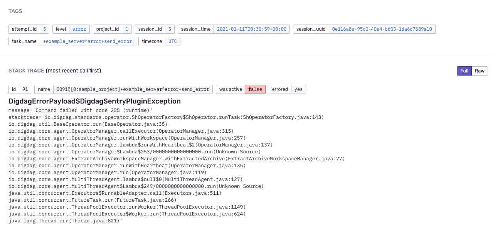

# digdag-plugin-sentry
[](https://github.com/treasure-data/digdag/releases/tag/v0.10.0)
[](https://jitpack.io/#to-lz1/digdag-plugin-sentry)

A Digdag plugin for sending errors to Sentry.

## Features

- You can use the `sentry>:` operator.
- You can easily add arbitrary tags for your issues.

## Usage

Specify this plugin dependency in `_export:` directive, and call `sentry>:` operator in `_error:` context.

```dig
_export:
  plugin:
    repositories:
      - https://jitpack.io
    dependencies:
      - com.github.to-lz1:digdag-plugin-sentry:0.3.0

_error:
  +notify:
    sentry>:
    dsn: https://your_sentry_dsn@project.ingest.sentry.io/0000000

+step1:
  sh>: sleep 1; exit 255
```

Error information will be sent to your Sentry project automatically.



### Sending Events

You can send some messages at any level (`debug`, `info`, `warning`, `error`, `fatal`) to your Sentry project. The default is `error`.

```dig
+step1:
  sentry>:
  severity: info
  message: some information to your Sentry project.

+step2:
  sentry>:
  severity: warning
  message: some warning to your Sentry project.
```

### Other features

If you don't want to write your Sentry DSN directly in `.dig` files, you can set it by using Digdag secrets. The secret key name is `sentry.dsn`.

```sh
# set your DSN
digdag secrets --project sample --set sentry.dsn
```

By doing this, you don't need declare dsn anymore.

```dig
...

_error:
  +send_error:
    sentry>:

  +send_message:
    sentry>:
    severity: fatal
    message: some additional fatal message from server.

+step1:
  sh>: your awesome task.
```

You can also set arbitrary tags to your issues.

```dig
...

_error:
  +send_error:
    sentry>:
    sentry_tags:
      tag_name_1: tag_value_1
      tag_name_2: tag_value_2

+step1:
  sh>: sleep 1; exit 255
```

Tags will be shown on project issues page like this:


## Development

see also: https://github.com/myui/digdag-plugin-example.

### 1) build

```sh
./gradlew publish
```

Artifacts are build on local repos: `./build/repo`.

### 2) run sample workflows

#### in local mode:

```sh
digdag selfupdate

digdag run --no-save --project sample \
  example_local.dig \
  -p repos=`pwd`/build/repo \
  -p dsn=https://your_sentry_dsn@project.ingest.sentry.io/0000000
```

#### in server mode:

Server mode sample will fetch the artifact from [JitPack.io](https://jitpack.io/).

```sh
digdag server --memory --config sample/server.properties

digdag push --project sample sample_project

digdag secrets --project sample_project --set sentry.dsn

digdag start sample_project example_server --session now
```
