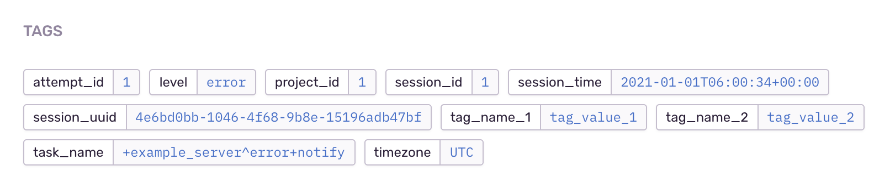

# digdag-plugin-sentry
[](https://github.com/treasure-data/digdag/releases/tag/v0.9.42)

A Digdag plugin for sending errors to Sentry.

## Features

- You can use the `sentry>:` operator in `_error:` directive.
- You can easily add arbitrary tags for your issues.

## Usage

Specify this plugin dependency in `_export:` directive, and call `sentry>:` operator in `_error:` context.

```dig
_export:
  plugin:
    repositories:
      - https://github.com/to-lz1/digdag-plugin-sentry/packages
    dependencies:
      - io.digdag.plugin:digdag-plugin-sentry:0.1.0

_error:
  +notify:
    sentry>:
    dsn: https://your_sentry_dsn@project.ingest.sentry.io/0000000

+step1:
  sh>: sleep 1; exit 255
```

If you don't want to write your Sentry DSN directly in `.dig` files, you can set it by using Digdag secrets. The secret key name is `sentry.dsn`.

```sh
# set your DSN
digdag secrets --project sample --set sentry.dsn
```

You can set arbitrary tags to your issues.

```dig
_export:
  plugin:
    repositories:
      - https://github.com/to-lz1/digdag-plugin-sentry/packages
    dependencies:
      - io.digdag.plugin:digdag-plugin-sentry:0.1.0

_error:
  +notify:
    sentry>:
    sentry_tags:
      tag_name_1: tag_value_1
      tag_name_2: tag_value_2

+step1:
  sh>: sleep 1; exit 255
```

Tags will be shown on project issues page like this:




## Development

see also: https://github.com/myui/digdag-plugin-example.

### 1) set `build.gradle` to publish jar locally

```
    repositories {
        maven {
            name "Local"
            url "$buildDir/repo"
        }
//        maven {
//            name = "GitHubPackages"
//            url = uri("https://maven.pkg.github.com/to-lz1/digdag-plugin-sentry")
//            credentials {
//                username = System.getenv("GITHUB_USERNAME")
//                password = System.getenv("GITHUB_TOKEN")
//            }
//        }
    }
```

### 2) build

```sh
./gradlew publish
```

Artifacts are build on local repos: `./build/repo`.

### 3) run sample workflows

For example, in local mode:

```sh
digdag selfupdate

digdag run --no-save --project sample \
  example_local.dig \
  -p repos=`pwd`/build/repo \
  -p dsn=https://your_sentry_dsn@project.ingest.sentry.io/0000000
```
